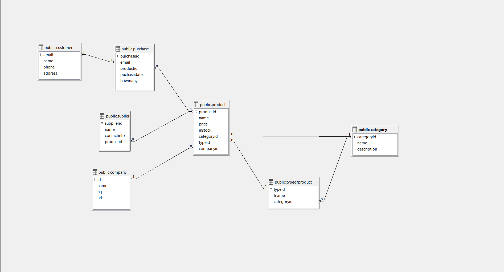

### **README: Online Store Database Project**

---

### **Project Overview**
This project involves the design and implementation of a relational database for an online store similar to Amazon, using LibreOffice Base. The database is designed to manage various aspects of the store, such as products, customers, suppliers, purchases, and the relationships between them. The project uses SQL (Structured Query Language) to define the database schema, insert data, and perform queries.

---

### **Tables in the Database**
The database consists of the following tables:



1. **Customer**: Stores information about the store's customers.
2. **Company**: Contains data about companies that manufacture products.
3. **Category**: Defines categories that group the products (e.g., Electronics, Books).
4. **TypeOfProduct**: Classifies specific types of products within each category (e.g., Phone, Laptop).
5. **Product**: Stores details of the products available in the store, including price, stock, and associations with companies, categories, and product types.
6. **Supplier**: Manages supplier details and links each supplier to the products they provide.
7. **Purchase**: Records purchase transactions made by customers, including product details and the number of items purchased.

---

### **SQL Table Definitions**
Here’s a breakdown of the SQL statements used to create each table in the database:

#### **Customer Table**
```sql
CREATE TABLE Customer (
    EMAIL VARCHAR(40) PRIMARY KEY,
    NAME VARCHAR(30),
    PHONE VARCHAR(14),
    ADDRESS VARCHAR(200)
);
```
- **EMAIL**: Primary key, unique identifier for each customer.
- **NAME, PHONE, ADDRESS**: General information about the customer.

#### **Company Table**
```sql
CREATE TABLE Company (
    ID INTEGER PRIMARY KEY,
    NAME VARCHAR(50),
    HQ VARCHAR(100),
    URL VARCHAR(100)
);
```
- **ID**: Primary key, unique identifier for each company.
- **NAME, HQ, URL**: Details about the company.

#### **Category Table**
```sql
CREATE TABLE Category (
    CATEGORYID INTEGER PRIMARY KEY,
    NAME VARCHAR(50),
    DESCRIPTION TEXT
);
```
- **CATEGORYID**: Primary key for each category.
- **NAME, DESCRIPTION**: Information about the category (e.g., Electronics, Books).

#### **TypeOfProduct Table**
```sql
CREATE TABLE TypeOfProduct (
    TYPEID INTEGER PRIMARY KEY,
    TNAME VARCHAR(50),
    CATEGORYID INTEGER,
    FOREIGN KEY (CATEGORYID) REFERENCES Category(CATEGORYID)
);
```
- **TYPEID**: Primary key for each type of product.
- **TNAME**: Type name (e.g., Phone, Laptop).
- **CATEGORYID**: Foreign key linking to the Category table.

#### **Product Table**
```sql
CREATE TABLE Product (
    PRODUCTID INTEGER PRIMARY KEY,
    NAME VARCHAR(100),
    PRICE DECIMAL(10,2),
    INSTOCK INTEGER,
    CATEGORYID INTEGER,
    TYPEID INTEGER,
    COMPANYID INTEGER,
    FOREIGN KEY (CATEGORYID) REFERENCES Category(CATEGORYID),
    FOREIGN KEY (TYPEID) REFERENCES TypeOfProduct(TYPEID),
    FOREIGN KEY (COMPANYID) REFERENCES Company(ID)
);
```
- **PRODUCTID**: Primary key for each product.
- **NAME, PRICE, INSTOCK**: Product details.
- **CATEGORYID, TYPEID, COMPANYID**: Foreign keys linking to the respective tables for categorization and supplier/manufacturer relationships.

#### **Supplier Table**
```sql
CREATE TABLE Supplier (
    SUPPLIERID INTEGER PRIMARY KEY,
    NAME VARCHAR(100),
    CONTACTINFO VARCHAR(100),
    PRODUCTID INTEGER,
    FOREIGN KEY (PRODUCTID) REFERENCES Product(PRODUCTID)
);
```
- **SUPPLIERID**: Primary key for each supplier.
- **NAME, CONTACTINFO**: Information about the supplier.
- **PRODUCTID**: Foreign key linking to the Product table.

#### **Purchase Table**
```sql
CREATE TABLE Purchase (
    PURCHASEID INTEGER PRIMARY KEY,
    EMAIL VARCHAR(40),
    PRODUCTID INTEGER,
    PUCHASEDATE DATE NOT NULL,
    HOWMANY INTEGER NOT NULL,
    FOREIGN KEY (EMAIL) REFERENCES Customer(EMAIL),
    FOREIGN KEY (PRODUCTID) REFERENCES Product(PRODUCTID)
);
```
- **PURCHASEID**: Primary key for each purchase.
- **EMAIL**: Foreign key linking to the Customer table.
- **PRODUCTID**: Foreign key linking to the Product table.
- **PUCHASEDATE, HOWMANY**: Date of purchase and number of items purchased.

---

### **SQL Functions and Clauses Used**

- **`CREATE TABLE`**: Used to define the structure of a table and specify its columns, data types, and constraints (e.g., primary key, foreign key).
- **`PRIMARY KEY`**: Ensures that the column(s) designated are unique and cannot be null. It identifies each row in the table uniquely.
- **`FOREIGN KEY`**: Establishes a relationship between two tables by linking a column in one table to the primary key in another table. This enforces referential integrity.
- **`VARCHAR`**: A variable-length string data type used to store text with a maximum length.
- **`DECIMAL`**: Used for numeric data, particularly when precise values (like price) are necessary. The format `DECIMAL(10,2)` allows for 10 digits total, with 2 after the decimal point.
- **`DATE`**: Represents a date without time.
- **`INTEGER`**: A whole number, often used for counting or identification purposes.
- **`NOT NULL`**: Ensures that a column cannot have `NULL` values, i.e., it must always contain a value.

---

### **SQL Queries for Data Insights**
Here are some SQL queries used to analyze the data in the store:

1. **How many electronic devices are in stock?**
   ```sql
   SELECT SUM(instock) AS total_electronics_instock
   FROM product
   WHERE categoryid = (
       SELECT categoryid 
       FROM category 
       WHERE name = 'Electronics'
   );
   ```
https://stackoverflow.com/questions/9574721/using-sum-in-an-sql-query

2. **Which companies make multiple types of products?**
   ```sql
   SELECT company.name, COUNT(DISTINCT typeofproduct.typeid) AS number_of_product_types
   FROM company
   JOIN product ON company.id = product.companyid
   JOIN typeofproduct ON product.typeid = typeofproduct.typeid
   GROUP BY company.name
   HAVING COUNT(DISTINCT typeofproduct.typeid) > 1;
   ```
https://stackoverflow.com/questions/6138518/count-in-sql

3. **List of customers who purchased a specific product (e.g., iPhone 13):**
   ```sql
   SELECT customer.name, customer.email
   FROM purchase
   JOIN customer ON purchase.email = customer.email
   JOIN product ON purchase.productid = product.productid
   WHERE product.name = 'iPhone 13';
   ```

4. **Total revenue generated from all purchases:**
   ```sql
   SELECT SUM(product.price * purchase.howmany) AS total_revenue
   FROM purchase
   JOIN product ON purchase.productid = product.productid;
   ```

5. **Most expensive product in each category:**
   ```sql
   SELECT category.name AS category_name, product.name AS product_name, product.price AS highest_price
   FROM product
   JOIN category ON product.categoryid = category.categoryid
   WHERE product.price = (
       SELECT MAX(p.price)
       FROM product p
       WHERE p.categoryid = product.categoryid
   );
   ```
---

## **Learn R Programming Language:**

https://www.w3schools.com/r/default.asp
